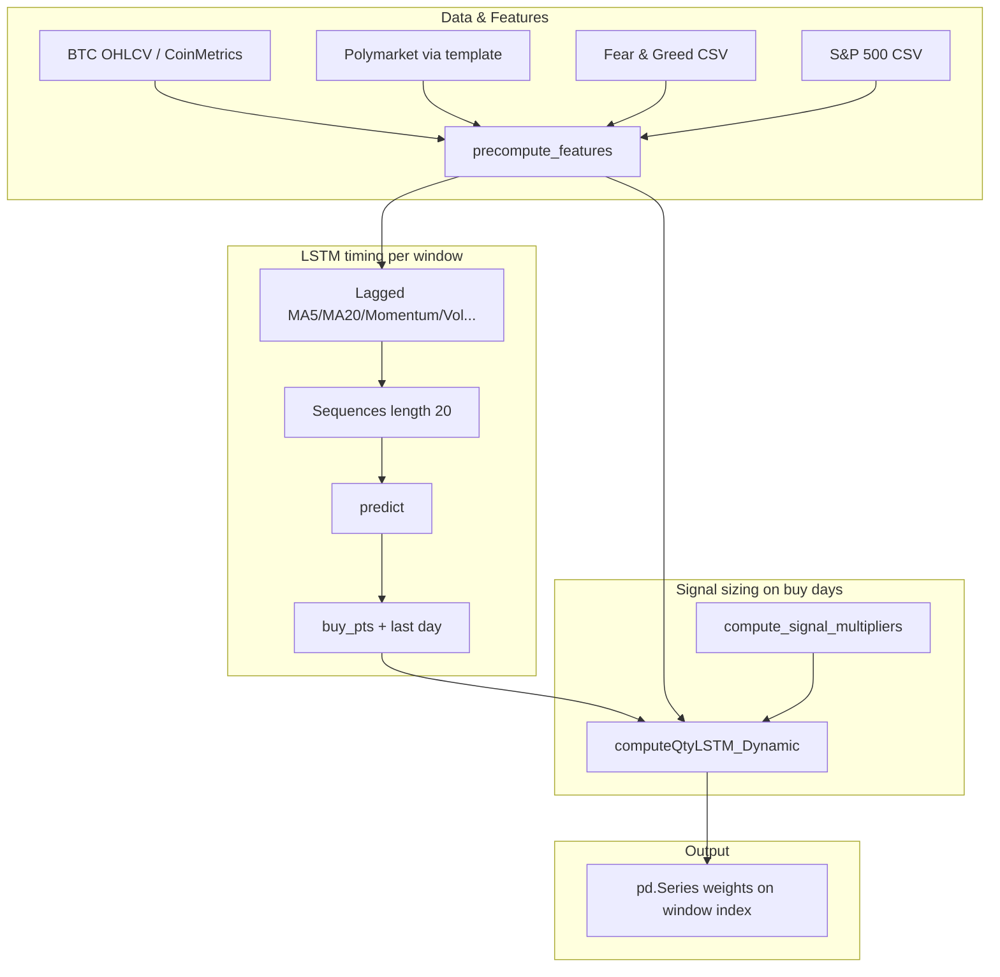
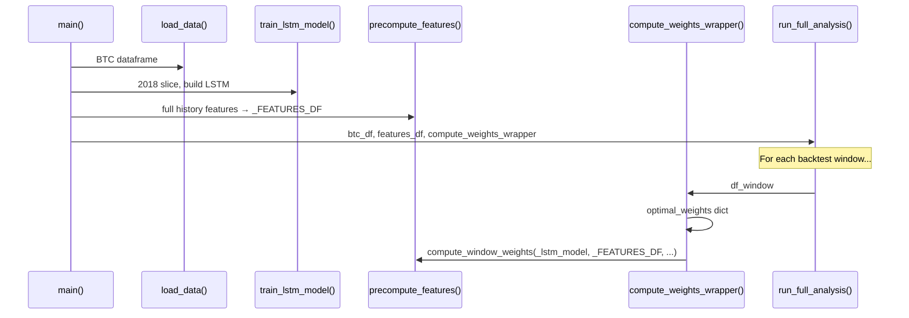

# Bitcoin DCA: LSTM Timing + Multi-Signal Sizing (Example 2)

This document explains the implementation in `model_development_example_2.py` and how `run_backtest.py` wires it into the capstone backtest. Example 1 (`model_example_1.md`) described a **purely deterministic** MVRV + 200-day MA strategy with sequential allocation. Example 2 **splits responsibilities**:

1. **LSTM timing** — identifies *when* to deploy capital (buy points) from short-horizon price dynamics.
2. **Interpolated signal sizing** — scales *how much* to deploy on those days using MVRV, Fear & Greed, Polymarket, S&P 500, and BTC vs MA, with **tunable weights** passed in from the backtest runner.

## Overview

| Layer | Role |
|--------|------|
| **LSTM** | On each investment window, builds lagged technical features from BTC price, runs inference, and marks **buy points** where the predicted series transitions from falling to rising (local minima in the prediction path). The **last day** of the window is always treated as a buy day so remaining budget can clear. |
| **Signal multipliers** | For each buy day, maps each signal to a raw multiplier via **linear interpolation** on fixed bounds, then blends toward neutral (`1.0`) using the weight dict. Final **conviction** is the product of the five multipliers (floored at `0.01`). |
| **Normalization** | Dollar amounts implied at buy points are converted to BTC quantity, then the vector is **normalized to sum to 1** so the result is a valid daily weight schedule for the template backtest. |

**Key properties**

- Weights are non-negative and sum to 1 after normalization in `computeQtyLSTM_Dynamic`.
- **Look-ahead control**: LSTM inputs use `shift(1)` on engineered columns; `precompute_features` shifts signal columns by one day before confidence is recomputed.
- **LSTM timing cache**: `_LSTM_TIMING_CACHE` keys `(start_date, end_date)` so repeated calls (e.g. grid search over sizing weights) do not re-run inference for the same calendar window.
- Sizing weights (`mvrv`, `fgi`, `poly`, `snp`, `ma`) are **not** learned inside the model file; `run_backtest.py` supplies a chosen dict (from grid search).

## End-to-end architecture



## `model_development_example_2.py` — implementation map

### 1. Auxiliary data loaders

| Function | Source | Fallback |
|----------|--------|----------|
| `load_fgi_data` | `data/crypto_fear_and_greed_index_2019_2025.csv` | Empty → FGI treated as neutral (`0.5` after reindex). |
| `load_snp_data` | `data/SP500.csv` | Empty → `snp_vs_ma` neutral (`0.0`). |
| `load_polymarket_btc_sentiment` | `template.prelude_template.load_polymarket_data` | Filters BTC-related questions; daily count + volume; 30-day rolling percentile blend → `polymarket_sentiment` in `[0,1]`. |

### 2. Feature engineering — `precompute_features`

- **Price / MA**: Same spirit as Example 1 — `price_vs_ma` from 200-day MA, clipped to `[-1, 1]`, from `2010-07-18` onward.
- **MVRV path** (if `CapMVRVCur` present): rolling z-score (365-day), gradient (30-day diff + EMA + `tanh`), acceleration (14-day), zone classification, volatility percentile (90-day vol vs 360-day rank). If MVRV is missing, MVRV-derived series default to neutral zeros / mid vol.
- **Merge**: Polymarket, FGI (`fgi_normalized`), S&P (`snp_vs_ma` from 20-day MA of close) aligned to BTC index (`reindex`, `ffill`, sensible defaults).
- **Lag**: All listed signal columns are **`shift(1)`** so day *t* weights do not use same-day raw data. Then `signal_confidence` is computed from the lagged arrays (agreement + gradient alignment, same structure as Example 1).

**Feature columns used later for sizing** (among others): `price_vs_ma`, `mvrv_zscore`, `polymarket_sentiment`, `fgi_sentiment`, `snp_vs_ma`.

### 3. Signal multipliers — `compute_signal_multipliers`

Each signal is mapped to a **raw** multiplier by `numpy.interp` between fixed endpoints, then combined:

```
m_final_k = 1.0 + w_k * (m_raw_k - 1.0)
conviction = max(0.01, Π_k m_final_k)
```

Default weights are zero → all `m_final_k = 1.0` → conviction `1.0`.

| Signal | Interpolation domain → range | Interpretation (direction) |
|--------|------------------------------|---------------------------|
| MVRV Z | `[-2, 2.5]` → `[1.5, 0.5]` | Lower Z (cheaper) → larger multiplier when the weight is positive. |
| FGI | `[0, 1]` → `[1.5, 0.5]` | Lower fear (greedier index) → larger multiplier when the weight is positive. |
| Polymarket | `[0, 1]` → `[0.8, 1.2]` | Attention tilt around neutral 0.5. |
| S&P vs MA | `[-0.05, 0.05]` → `[0.8, 1.2]` | Risk-on/off vs 20-day MA. |
| BTC vs MA | `[-0.1, 0.1]` → `[0.8, 1.2]` | BTC stretched below MA → larger multiplier when the weight is positive. |

Weights are **scalars** that control how strongly each raw curve pulls conviction away from 1.0.

### 4. LSTM feature matrix and buy points — `compute_weights_fast`

For the window `[start_date, end_date]`:

1. **Cache lookup** on `(start_date, end_date)`. If miss:
   - Build `df_small` from `PriceUSD_coinmetrics`: `Momentum`, `Acceleration`.
   - Add `MA5`, `MA20`, `MomentumMA`, `AccelerationMA`, `Volatility` (rolling stats).
   - Take **`shift(1)`** of the six input columns and join back to price; **`dropna`** starts the series where all lags exist.
   - `MinMaxScaler` → `create_sequences(..., window=20)` → `model.predict`.
   - **Buy rule**: iterate `pred_inv`; when the sequence goes from decreasing to increasing (`downTrend` then `upTrend` flip), append index `i` (a position in the prediction sequence, length `len(df) - 20` for `df` the `join` + `dropna` frame).
2. **Sizing**: `computeQtyLSTM_Dynamic(df_inp, buy_pts, weights)` walks `df_inp` with a positional counter `cnt` and treats `cnt in buy_pts` as a buy day, then normalizes quantities to weights. **Indexing detail:** `buy_pts` come from the LSTM branch on `df` (possibly fewer leading rows than `df_inp` after `dropna`); in typical windows with long history, `df` and `df_inp` often align so `cnt` matches the intended prediction step, but the two lengths can differ at the start of a slice—worth keeping in mind when changing timing logic.

**Note:** `create_sequences` uses `y = data[i + window, 0]` (first column of scaled data). Training in `run_backtest.py` aligns the same column order so the network is trained as a **next-step regressor** on the scaled feature matrix (see below), not as a classifier on extrema labels.

### 5. Window wrapper — `compute_window_weights`

- Fills **missing calendar days** in `features_df` with neutral placeholders (zeros, `mvrv_zone=0`, vol/signal_confidence defaults).
- Computes `n_past` from `start_date` to `min(current_date, end_date)` but **`compute_weights_fast` in this file does not currently branch on `n_past` or `locked_weights`** (those parameters are accepted for API compatibility). The returned series is **reindexed** to the full daily `date_range` with `fill_value=0.0`.

So for production-style “lock past / uniform future” behavior as in Example 1, this module would need an explicit split; the current Example 2 path is **LSTM + dynamic sizing over the whole window** as produced by `computeQtyLSTM_Dynamic`.

---

## `run_backtest.py` — execution flow



### Determinism

`set_deterministic_seeds(42)` sets Python, NumPy, and TensorFlow seeds so runs are repeatable.

### LSTM training — `train_lstm_model`

- Filters **`df_inp.index.year == 2018`**.
- Builds the **same** technical columns as inference (momentum, acceleration, MAs, vol), shifted join, `dropna`.
- The code assigns **`Target`** labels via `scipy.signal.argrelextrema` on price (local max = 1, min = 2). The training dataframe passed to `MinMaxScaler` is **`PriceUSD_coinmetrics` + shifted technicals only** — the `Target` column is **not** included in that matrix. Training therefore minimizes **MSE** on **`y = next timestep of column 0`** (scaled first feature, i.e. price in the scaled ordering), for 30 epochs, Adam, batch 16, LSTM(100) + Dropout(0.2) + Dense(1).

### Optimal sizing weights (current script)

`compute_weights_wrapper` injects:

| Key | Value | Note |
|-----|-------|------|
| `mvrv` | 1.0 | |
| `fgi` | 7.0 | Strong emphasis on Fear & Greed interpolation. |
| `poly` | 6.0 | Strong Polymarket tilt. |
| `snp` | 0.0 | Macro term inactive. |
| `ma` | 0.0 | BTC MA term inactive. |

Comments in file reference a grid search score; the dict is the hand-off point between **hyperparameter tuning** and **backtest**.

### Analysis hook

`run_full_analysis` (from `template.backtest_template`) receives:

- `btc_df`, `features_df`, `compute_weights_fn`, `output_dir`, `strategy_label` (e.g. `"Final Capstone: LSTM + FGI(7.0) + Poly(6.0)"`).

The wrapper closes over the **global** `_FEATURES_DF` and `_lstm_model`.

---

## Constants reference (Example 2)

| Name | Value | Role |
|------|-------|------|
| `MIN_W` | `1e-6` | Floor quantity in `computeQtyLSTM_Dynamic` on non-buy days. |
| `MA_WINDOW` | 200 | BTC long MA for `price_vs_ma`. |
| `MVRV_ROLLING_WINDOW` | 365 | Z-score window. |
| `MVRV_GRADIENT_WINDOW` | 30 | Gradient / EMA span. |
| `MVRV_ACCEL_WINDOW` | 14 | Acceleration diff span. |
| `MVRV_VOLATILITY_WINDOW` | 90 | Volatility rolling std. |
| `DYNAMIC_STRENGTH` | 5.0 | Defined in module; **Example 2 sizing does not use the Example 1 `exp(combined * DYNAMIC_STRENGTH)` path** — conviction is product-of-interps instead. |
| Zone thresholds | −2, −1, 1.5, 2.5 | MVRV zone buckets (features still computed for consistency / future use). |

---

## Data requirements

| Asset / file | Columns / usage |
|--------------|-----------------|
| CoinMetrics BTC (via `load_data`) | `PriceUSD_coinmetrics`; optional `CapMVRVCur`. |
| Polymarket | Via template loader; BTC question filter. |
| FGI CSV | `date`, `value`, `value_classification`. |
| S&P CSV | `Date`, `Close`. |

Paths are resolved relative to the repo: `data/` under the project root (see `Path(__file__).parent.parent` in loaders).

---

## Comparison: Example 1 vs Example 2

| Aspect | Example 1 | Example 2 |
|--------|-----------|-----------|
| **Timing** | Every day gets a structural weight via `allocate_sequential_stable` and dynamic multiplier curve. | Sparse **buy days** from LSTM prediction inflections + forced last day. |
| **Sizing** | Single combined signal → `exp(clip(...))` on MVRV/MA (+ Polymarket in Ex1). | **Per-signal interpolation** × **independent weights** (grid-searched in runner). |
| **ML** | None. | TensorFlow LSTM trained on 2018 BTC features. |
| **Extra inputs** | Polymarket (in doc). | Polymarket, FGI, S&P 500, plus full MVRV feature stack for multipliers and diagnostics. |
| **Caching** | N/A. | LSTM buy indices cached per `(start_date, end_date)`. |

---

## File reference

| File | Responsibility |
|------|----------------|
| `model_development_example_2.py` | Feature precomputation, LSTM inference + buy points, signal multipliers, `compute_weights_fast` / `compute_window_weights`. |
| `run_backtest.py` | Seed training, optimal `weights` dict, globals for model + features, `run_full_analysis` entrypoint. |
| `template.backtest_template.run_full_analysis` | Portfolio simulation, metrics, plots (not duplicated here). |

This should be enough to navigate the code, reproduce the pipeline, and see where to change **timing** (LSTM features / buy rules) versus **sizing** (interpolation tables or `optimal_weights` in `run_backtest.py`).
