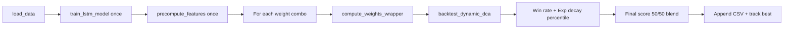

# Two-Stage Signal Weight Optimization

This document describes how `optimize_weights.py` and `optimize_weights_2.py` search for sizing weights passed into `compute_signal_multipliers` in `model_development_example_2.py`. The process is intentionally **two stages**: a coarse grid over **all five** signal weights, then a focused grid over **FGI and Polymarket only** after fixing the other three at values that the first stage (and inspection of the results) support as a strong default.

## Why two stages?

1. **Stage 1** (`optimize_weights.py`): Enumerate `{0, 0.5, 1.0, 2.0}` for each of `mvrv`, `fgi`, `poly`, `snp`, `ma` → **4⁵ = 1,024** backtests. This is enough to see which dimensions matter and where the best combinations concentrate (in the saved run, the top configuration uses **MVRV = 1.0** and **SNP = MA = 0.0**).
2. **Stage 2** (`optimize_weights_2.py`): **Lock** `mvrv=1.0`, `snp=0.0`, `ma=0.0` and sweep **FGI** and **Poly** over **1.0 … 10.0** in steps of 1 → **10² = 100** backtests. Sentiment-style weights can dominate at larger magnitudes, so a finer range on just those two avoids an explosion of runs in the first stage while still exploring strong scaling.

The weights chosen for production backtests are in `run_backtest.py`:

`{'mvrv': 1.0, 'fgi': 7.0, 'poly': 6.0, 'snp': 0.0, 'ma': 0.0}` — matching the best row in `example_LSTM_merged_2\output\optimization_results_2.csv`.

## Shared pipeline

Both scripts follow the same pattern:



| Step | Detail |
|------|--------|
| **Model state** | Globals `_FEATURES_DF`, `_LSTM_MODEL`, `_CURRENT_WEIGHTS`; wrapper calls `compute_window_weights(..., weights=_CURRENT_WEIGHTS)`. |
| **Backtest** | `template.prelude_template.backtest_dynamic_dca(btc_df, compute_weights_wrapper, features_df=_FEATURES_DF, ...)`. |
| **Objective** | `win_rate = mean(dynamic_percentile > uniform_percentile) × 100`, combined with `exp_decay_percentile` from the same run: **`score = 0.5 × win_rate + 0.5 × exp_decay_percentile`**. |
| **Logging** | Root logger set to `WARNING` during each inner backtest to reduce noise; iteration lines printed at `INFO`. |
| **Persistence** | Each iteration is appended to a CSV immediately; at the end, best weights and metrics are written to JSON. |

## Stage 1: `optimize_weights.py`

| Item | Value |
|------|--------|
| **Grid** | Each of `mvrv`, `fgi`, `poly`, `snp`, `ma` ∈ `{0.0, 0.5, 1.0, 2.0}`. |
| **Count** | 1,024 combinations. |
| **Output CSV** | `example_LSTM_merged_2\output\optimization_results.csv` |
| **Output JSON** | `example_LSTM_merged_2\output\optimal_weights.json` |

Columns in the CSV: `Iteration`, `MVRV`, `FGI`, `Poly`, `SNP`, `MA`, `Win_Rate`, `Exp_Decay`, `Final_Score`.

### Result snapshot (from `optimization_results.csv`)

On the committed CSV, the **global maximum** `Final_Score` occurs at **iteration 753** with:

| MVRV | FGI | Poly | SNP | MA | Win_Rate | Exp_Decay | Final_Score |
|------|-----|------|-----|-----|----------|-----------|-------------|
| 1.0 | 2.0 | 2.0 | 0.0 | 0.0 | 99.22% | 48.37% | **73.79%** |

Among all rows, the same file shows that strong scores cluster with **MVRV = 1**, **SNP = 0**, **MA = 0** (the global best above already satisfies that). That motivates fixing those three in stage 2 and only expanding the grid for FGI and Poly to larger values (the coarse stage only goes up to **2.0** on each weight).

## Stage 2: `optimize_weights_2.py`

| Item | Value |
|------|--------|
| **Fixed** | `mvrv = 1.0`, `snp = 0.0`, `ma = 0.0` |
| **Grid** | `fgi`, `poly` each ∈ `{1.0, 2.0, …, 10.0}`. |
| **Count** | 100 combinations. |
| **Output CSV** | `example_LSTM_merged_2\output\optimization_results_2.csv` |
| **Output JSON** | `example_LSTM_merged_2\output\optimal_weights_2.json` |

### Result snapshot (from `optimization_results_2.csv`)

The **best** row in the committed file is **iteration 66**:

| MVRV | FGI | Poly | SNP | MA | Win_Rate | Exp_Decay | Final_Score |
|------|-----|------|-----|-----|----------|-----------|-------------|
| 1.0 | **7.0** | **6.0** | 0.0 | 0.0 | 96.87% | 54.08% | **75.48%** |

Those numbers align with the comments in `run_backtest.py` (score ~75.48%, win rate ~96.87%, exponential-decay percentile ~54.08%). Stage 2 improves the objective over the stage‑1 best because FGI/Poly can exceed 2.0, which the first grid never tried.

## How to re-run

From the repository root (with your Python environment activated):

```text
py -3 example_LSTM_merged_2/optimize_weights.py
py -3 example_LSTM_merged_2/optimize_weights_2.py
```

Each run retrains the LSTM and precomputes features once, then loops. Full stage 1 is **1,024** full dynamic DCA backtests — expect a long wall-clock time.

## Related docs and code

| Resource | Role |
|----------|------|
| `example_LSTM_merged_2\model_example_2.md` | How weights enter `compute_signal_multipliers` and the LSTM path. |
| `example_LSTM_merged_2\run_backtest.py` | Uses the stage‑2 optimal dict for `run_full_analysis`. |
| `template.prelude_template.backtest_dynamic_dca` | Supplies `df_spd` and `exp_decay_percentile` used in the score. |

## Practical notes

- **Reproducibility**: `train_lstm_model` in `run_backtest.py` sets deterministic seeds; optimization assumes the same data and code produce comparable scores across runs.
- **LSTM cache**: `model_development_example_2.compute_weights_fast` caches buy points per `(start_date, end_date)`, which speeds up repeated backtests that share the same LSTM model and feature matrix.
- **Refining further**: If you change the score definition or backtest template, re-run both stages (or at least stage 2) so CSVs and `run_backtest.py` stay consistent.

---

## AI Disclaimer

This markdown file is generated with help of Cursor, referencing used python files and the model example markdown files.
